# **CS205 C/ C++ Program Design - Project 2**

**Name: Yunhao Ma**

**SID: 11911523**

# **Part 1 - Analysis**
The problem is to implement an operator which can solve plentiful operations from terminal, including simple four operations, operations with one or multiple brackets, mathematical functions. special math formulas and  any arbitrary precision operations. This project is very challenging, and in completing this project, I used `stack` to better implement the operation priority of the four operations. Besides, in order to match the requirement of arbitrary precision, I also learn something about `vector`. I will explain more in the following part.

**Libraries and Methods used in this project:**

`#include<iostream>`provides the input and output function of this project. 

`#include<stack>`is the most important part in my code. **Stack** is a **last in first out** module, which is very helpful in dealing with this project. Generally, the principle of stack used in my work can be shown as the following.

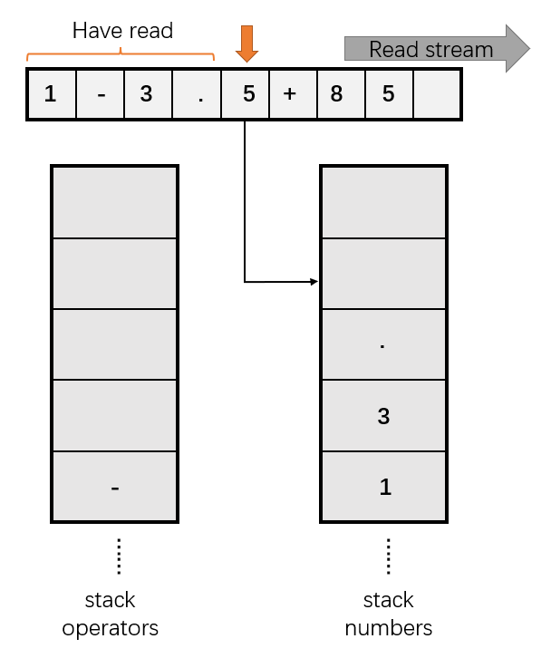

`#include<cstring>` is used to make the conversion between `char` and `string` or other operations about `string`.

`#include<algorithm>`provides method `reverse`, which can reverse certain string from end to beginning. 

`#include<math.h>` is used to use special math formula to quickly calculate the answer of input stream as long as there are key words. In my work, the supported formulas are `sin`, `cos`, and `sqrt`, which are very typical formulas and are widely used in real cases.

`#include<vector>` is used to match the requirement of arbitrary precision in terms of division. `vector` is one of the most commonly used containers, and the underlying data structure is very simple, just a continuous linear memory space. Personally, it's more like a dynamic array.

This task is never easy, because there are many cases for consideration.


1. Obtaining arguments from the **terminal**. In the project, I use `scanf("%s", s) ` as the read input where `s` is a `char[1000]`. Considering that the input maybe multi-lines when the inputs are functions, easy judgments are held to distinguish functions and further read another two lines. For basic digital cases, **stacks** are used for calculation. I declare  two stacks in my project, where one is for operators and the other is for numbers. For every input line, the stack use `push`to get the new item and use `pop` to remove the old item. Additionally, the use of `top` is also useful to get the latest item from the input stream. The key code is shown here. `priority` is to show the order of the operators.

   ```cpp
   void stack_for_calculate(char s[maxn]){
       int i=0;
       int len = strlen(s); 
       int cnt = 0;   
   	bool flag = false; 
       if (s[i] == '-') flag = true, i = 1; 
   	while (i < len) {
   	if (s[i] == '(') operate_sign.push(s[i]),i++;
   	else if (s[i] == ')') {
   			while (operate_sign.top() != '(') cal();//cal is simple + - * /
   			operate_sign.pop();
   			i++;
   		}
   	else if (s[i] <= '9' && s[i] >= '0' || s[i] == '.') {
   			while (s[i] <= '9' && s[i] >= '0' || s[i] == '.'){
                       temp[cnt++] = s[i++];
               }
   			temp[cnt] = 0;
   			if (flag) {
                   operate_num.push(-str2double(temp));
                   flag = false;
               }
   			else operate_num.push(str2double(temp));
   			cnt = 0;
   		}
   	else {
               while (!operate_sign.empty() && priority(s[i]) < priority(operate_sign.top())){
                   cal();
               }
   			operate_sign.push(s[i]);
   			i++;
   		}
   	}
   	while (!operate_sign.empty()){
           cal();
       } 
   	printf("%.5lf\n", operate_num.top());
   	return;
   }
   ```

   

2. `math_function_detect(char char[1000])` is used to identify if the inputs have x or y. When it comes to functions considering `x` and `y`, I take the first two line to get the assignment for x and y, and the third line can hold the operation string including division, multiply, addition and subtraction. Users can put  both the assignment for x and y in each row they want. In this case, `string.replace()` is highly used for `x` and `y` in the original text. After that, the entire string can be digit-only, which is easier for calculation.

3. The **special formulas** including **sin, cos, sqrt** are supported in this work. Since I have finish the numeration operation for normal input string, I just simply replace these items into their corresponding values in digits. In this case, not only`string.replace()` and `string.substr()` are highly used for necessary replacement, but also method `substr_math_func` is used. The method is shown as below. In the code, I get the number of elements in parentheses and the numeric value of type string that the mathematical formula calculates as a result, and combine them to return.

   ```cpp
   //support functions: sqrt, cos, sin
   string substr_math_func(string s_origion, int index){
       char ch[maxn];
       strcpy(ch,s_origion.c_str());
       int left_bracket = 0; int right_bracket = 0;
       int flag = 0 ;
       for (int i = index; i < s_origion.size(); i++)
       {
           if (ch[i]=='s'&&flag == 0){
               if (ch[i+1]=='q'&& (i+1< s_origion.size())){//sqrt
                   left_bracket = i+4;
                   flag = 1;
               }
               else{//sin
                   left_bracket = i+3;
                   flag = 3;
               }
           }
           else if (ch[i]==')'){
               right_bracket = i;
               break;
           }
           else if (ch[i]=='c'){
               left_bracket = i+3;
               flag = 2;
           } 
       }
       int distance = right_bracket-left_bracket-1;
       string s_op = s_origion.substr(left_bracket+1,distance);
       double op = stod(s_op);
       switch (flag)
       {
       case 1:
           op = sqrt(op);
           break;
       case 2:
           op = cos(op);
           break;
       case 3:
           op = sin(op);
           break;
       default:
           break;
       }
       string return1 = to_string(op);
       string return2 = to_string(distance);
       return return2+return1;
   }
   ```

   After that, the entire string can be digit-only, which is easier for calculation. Moreover, I also use `strcpy` and `c_str()`to convert `string` to `char[]`.

4. Generally, the input string is held into stacks, where `operate_sign` is for operators and `operate_num` is for numbers. In this case, I consider brackets and  priority of operations. When meeting a `( )`, operations in that bracket must be done firstly, after which the basic four operations can be held. Besides, considering more than the maximum range of inputs, I reinvented a **high-precision adaptation of four operators**, dedicated to the four operations of big data. The implementation of big number addition in code is shown below. (The left three are similar.)

   ```c++
   string myAdd(string a,string b)	
   {   
       if (a.find(".")>=0&&a.find(".")<a.size()&&b.find(".")>=0&&b.find(".")<b.size()){
           string a_r = a.substr(a.find(".")+1); string a_l = a.substr(0,a.find("."));
           string b_r = b.substr(b.find(".")+1); string b_l = b.substr(0,b.find("."));
           reverse(a_r.begin(),a_r.end());
           reverse(b_r.begin(),b_r.end());
           string answer_l = myAdd(a_l,b_l);
           string answer_r = myAdd(a_r,b_r);
           reverse(answer_r.begin(),answer_r.end());
           return answer_l+"."+answer_r;
       }
       else if(a.find(".")>=0&&a.find(".")<a.size()){
           string a_r = a.substr(a.find(".")+1); string a_l = a.substr(0,a.find("."));
           string answer_l = myAdd(a_l,b);
           return answer_l+"."+a_r;
       }
       else if(b.find(".")>=0&&b.find(".")<b.size()){
           string b_r = b.substr(b.find(".")+1); string b_l = b.substr(0,b.find("."));
           string answer_l = myAdd(a,b_l);
           return answer_l+"."+b_r;
       }
   	int n=max(a.size(),b.size())+1;    
   	vector<int>ans(n,0);
   	int i=a.size()-1,j=b.size()-1,k=n-1;
   	while(i>=0&&j>=0) 
   	{
   		ans[k--]=(a[i--]-'0')+(b[j--]-'0');
   	}
   	while(j>=0)
   	{
   		ans[k--]=(b[j--]-'0');
   	}
   	while(i>=0)
   	{
   		ans[k--]=(a[i--]-'0');
   	}
   	string c="";
   	for(int i=n-1;i>0;i--)
   	{ 
   		if(ans[i]>=10)
   		{
   			ans[i]-=10;
   			ans[i-1]++;
   		}
   		c.insert(0,1,ans[i]+'0');
   	} 
   	
   	if(ans[0]>0)
   	{
   		c.insert(0,1,ans[0]+'0');
   	}
   	return c;
   }
   ```

    

5. In the part 3, I test many cases, including examples that appear in the course PPT and extra verifications like **combination** of  multiple special formulas and brackets, and **big numbers' four type operation**, indicating the completeness of the code.

# **Part 2 - Complete Codes**
```c++
#include<iostream>
#include<stack>
#include<cstring>
#include<math.h>
#include <algorithm>
#include<vector>
using namespace std;

const int maxn = 1000;
char s[maxn], temp[maxn];
char s1[maxn];
char s2[maxn];
stack<char> operate_sign;
stack<double> operate_num;

int myCompare(string a,string b)
{
	if(a.size()!=b.size())
	{
		if(a.size()>b.size())
			return 1;
		else 
			return -1;
	}
	else
	{
		if(a>b)
			return 1;
		else if(a==b)
			return 0;
		else 
			return -1;
	}
}
string myAdd(string a,string b)	
{   
    if (a.find(".")>=0&&a.find(".")<a.size()&&b.find(".")>=0&&b.find(".")<b.size()){
        string a_r = a.substr(a.find(".")+1); string a_l = a.substr(0,a.find("."));
        string b_r = b.substr(b.find(".")+1); string b_l = b.substr(0,b.find("."));
        reverse(a_r.begin(),a_r.end());
        reverse(b_r.begin(),b_r.end());
        string answer_l = myAdd(a_l,b_l);
        string answer_r = myAdd(a_r,b_r);
        reverse(answer_r.begin(),answer_r.end());
        return answer_l+"."+answer_r;
    }
    else if(a.find(".")>=0&&a.find(".")<a.size()){
        string a_r = a.substr(a.find(".")+1); string a_l = a.substr(0,a.find("."));
        string answer_l = myAdd(a_l,b);
        return answer_l+"."+a_r;
    }
    else if(b.find(".")>=0&&b.find(".")<b.size()){
        string b_r = b.substr(b.find(".")+1); string b_l = b.substr(0,b.find("."));
        string answer_l = myAdd(a,b_l);
        return answer_l+"."+b_r;
    }
	int n=max(a.size(),b.size())+1;    
	vector<int>ans(n,0);
	int i=a.size()-1,j=b.size()-1,k=n-1;
	while(i>=0&&j>=0) 
	{
		ans[k--]=(a[i--]-'0')+(b[j--]-'0');
	}
	while(j>=0)
	{
		ans[k--]=(b[j--]-'0');
	}
	while(i>=0)
	{
		ans[k--]=(a[i--]-'0');
	}
	string c="";
	for(int i=n-1;i>0;i--)
	{ 
		if(ans[i]>=10)
		{
			ans[i]-=10;
			ans[i-1]++;
		}
		c.insert(0,1,ans[i]+'0');
	} 
	
	if(ans[0]>0)
	{
		c.insert(0,1,ans[0]+'0');
	}
	return c;
}

string mySubtract(string a,string b)
{   if (a.find(".")>=0&&a.find(".")<a.size()&&b.find(".")>=0&&b.find(".")<b.size()){
        string a_r = a.substr(a.find(".")+1); string a_l = a.substr(0,a.find("."));
        string b_r = b.substr(b.find(".")+1); string b_l = b.substr(0,b.find("."));
        reverse(a_r.begin(),a_r.end());
        reverse(b_r.begin(),b_r.end());
        string answer_l = mySubtract(a_l,b_l);
        string answer_r = mySubtract(a_r,b_r);
        reverse(answer_r.begin(),answer_r.end());
        return answer_l+"."+answer_r;
    }
    else if(a.find(".")>=0&&a.find(".")<a.size()){
        string a_r = a.substr(a.find(".")+1); string a_l = a.substr(0,a.find("."));
        string answer_l = mySubtract(a_l,b);
        return answer_l+"."+a_r;
    }
    else if(b.find(".")>=0&&b.find(".")<b.size()){
        string b_r = b.substr(b.find(".")+1); string b_l = b.substr(0,b.find("."));
        string answer_l = mySubtract(a,b_l);
        return answer_l+"."+b_r;
    }
	string c="";    
    bool flag_neg=false;           
	if(myCompare(a,b)==0)     
		return "0";
	if(myCompare(a,b)==-1) 
	{
		swap(a,b);
		c.push_back('-');
        flag_neg = true;
	}
	int n=a.size();
 
	vector<int>ans(n,0);
	int i=a.size()-1,j=b.size()-1,k=n-1;
	int t=0;
	while(i>=0)
	{
	    char nowb;
	    if(j>=0) nowb=b[j];
	    else nowb='0';
		ans[k]=a[i]-nowb-t;
		if(ans[k]<0)
		{
			t=1;
			ans[k]+=10;
		} 
		else t=0;
		k--,i--,j--;
	}
	bool flag=true;
	for(int i=0;i<n;i++)
	{
		if(flag&&ans[i]==0)
			continue;
		flag=false; 
		c.push_back(ans[i]+'0');	
	}	 
	return c;
}
string myMultiply(string a,string b)
{   
    int a_point = (a.find(".")>=0&&a.find(".")<a.size())?a.find("."):0;
    int b_point = (b.find(".")>=0&&b.find(".")<b.size())?b.find("."):0;
    if (a_point!=0)
    {
        a = a.erase(a_point,1);
    }
    if (b_point!=0)
    {
        b = b.erase(b_point,1);
    }
	if(a=="0"||b=="0")
		return "0";
	vector<int>ans;
	int n=a.size(),m=b.size();
	ans.resize(n+m,0);   
	for(int i=0;i<n;i++) 
	{                    
		for(int j=0;j<m;j++)
		{
			ans[i+j+1]+=(a[i]-'0')*(b[j]-'0');
		}
	}
	for(int i=n+m-1;i>0;i--)      
	{
		if(ans[i]>=10)            
		{
			ans[i-1]+=(ans[i]/10);
			ans[i]%=10;           
		}
	} 
	string c ="";   
	bool flag=true; 
	for(int t=0;t<n+m;t++)
	{
		if(flag&&ans[t]==0)
			continue;
		flag=false;
		c.push_back(ans[t]+'0');	
	}	 
    if (a_point==0&&b_point==0){
        return c;  
    }
    else{
        if (a_point!=0&&b_point!=0)
        {   
            int point = a.size()-a_point-1 + b.size()-b_point-1;
            c.insert(c.size()-2-point,".");
        }
        else if (a_point!=0){
            c.insert(b.size()+a_point-1,".");
        }
        else{
            c.insert(a.size()+b_point-1,".");
        }
        return c; 
    }    
}
vector<string>myDivide(string a,string b)
{   
    
	vector<string>ans(2,"0");
	if(myCompare(a,b)==-1)   
	{
		ans[1]=a;
		return ans;
	}
	else if(myCompare(a,b)==0)
	{
		ans[0]="1";
		return ans;
	}
	else             
	{
		string res="";
		int m1=a.size(),m2=b.size();
		string a1=a.substr(0,m2-1);
		for(int i=m2-1;i<m1;i++)     
		{	
			if(a1=="0")			    
				a1=""; 
			a1.push_back(a[i]);     
			int e=0;
			while(myCompare(a1,b)>=0)
			{
				e++;
				a1=mySubtract(a1,b);
			}
			if(res.size()||e)        
				res.push_back(e+'0');
		}
		ans[0]=res;  
		ans[1]=a1;   
		return ans;  
	}
}

double str2double(char s[]) {
	int len = strlen(s);
	double sum1 = 0;
	double sum2 = 0;
	bool flag = false;
	for (int i = 0; i < len; i++) {
		if (s[i] == '.') {
			flag = true;
			break;
		}
		sum1 = sum1 * 10 + s[i] - '0';//back to integer
	}
	if (flag) {
		for (int i = len - 1; i >= 0; i--) {
			if (s[i] == '.') break;
			sum2 = (sum2 + s[i] - '0') / 10.0;
		}
	}
	return sum1 + sum2;
}

int priority(char ch) {
	if (ch == '*' || ch == '/') return 2;
	if (ch == '+' || ch == '-') return 1;
	return 0;
}

void cal() {
	double x = operate_num.top(); operate_num.pop();
	double y = operate_num.top(); operate_num.pop();
	switch (operate_sign.top()) {
	case '+': 
        y = y+x;
        break;
	case '-': 
        y = y-x;
        break;
	case '*':  
        y = y*x;
        break;
	case '/':
        y = y/x; 
        break;
	}
	operate_num.push(y);//put the answer into stack_num
	operate_sign.pop();//remove sign from stack_sign
    return;
}

void stack_for_calculate(char s[maxn]){
    int i=0;
    int len = strlen(s); 
    int cnt = 0;   
	bool flag = false; 
    if (s[i] == '-') flag = true, i = 1; 
	while (i < len) {
	if (s[i] == '(') operate_sign.push(s[i]),i++;
	else if (s[i] == ')') {
			while (operate_sign.top() != '(') cal();
			operate_sign.pop();
			i++;
		}
	else if (s[i] <= '9' && s[i] >= '0' || s[i] == '.') {
			while (s[i] <= '9' && s[i] >= '0' || s[i] == '.'){
                    temp[cnt++] = s[i++];
            }
			temp[cnt] = 0;
			if (flag) {
                operate_num.push(-str2double(temp));
                flag = false;
            }
			else operate_num.push(str2double(temp));
			cnt = 0;
		}
	else {
            while (!operate_sign.empty() && priority(s[i]) < priority(operate_sign.top())){
                cal();
            }
			operate_sign.push(s[i]);
			i++;
		}
	}
	while (!operate_sign.empty()){
        cal();
    } 
	printf("%.5lf\n", operate_num.top());
	return;
}

//support functions: sqrt, cos, sin
bool math_function_detect(char ch[maxn]){
    for (int i = 0; i < strlen(ch); i++)
    {
        if (ch[i]=='s'){
            return true;
        }
    }
    return false;
}
bool math_function_detect_str(string str){
    char ch[maxn];
    strcpy(ch,str.c_str());
    for (int i = 0; i < strlen(ch); i++)
    {
        if (ch[i]=='s'){
            return true;
        }
    }
    return false;
}

//support functions: sqrt, cos, sin
string substr_math_func(string s_origion, int index){
    char ch[maxn];
    strcpy(ch,s_origion.c_str());
    int left_bracket = 0; int right_bracket = 0;
    int flag = 0 ;
    for (int i = index; i < s_origion.size(); i++)
    {
        if (ch[i]=='s'&&flag == 0){
            if (ch[i+1]=='q'&& (i+1< s_origion.size())){//sqrt
                left_bracket = i+4;
                flag = 1;
            }
            else{//sin
                left_bracket = i+3;
                flag = 3;
            }
        }
        else if (ch[i]==')'){
            right_bracket = i;
            break;
        }
        else if (ch[i]=='c'){
            left_bracket = i+3;
            flag = 2;
        } 
    }
    int distance = right_bracket-left_bracket-1;
    string s_op = s_origion.substr(left_bracket+1,distance);
    double op = stod(s_op);
    switch (flag)
    {
    case 1:
        op = sqrt(op);
        break;
    case 2:
        op = cos(op);
        break;
    case 3:
        op = sin(op);
        break;
    default:
        break;
    }
    string return1 = to_string(op);
    string return2 = to_string(distance);
    return return2+return1;
}

bool big_number_detect(char ch[maxn]){
    int integer_cnt = 0;
    int frac_cnt = 0;
    bool flag = false;
    int operator_cnt=0;
    for (int i = 0; i < strlen(ch); i++)
    {   
        if (ch[i]=='+'||ch[i]=='-'||ch[i]=='*'||ch[i]=='/')
        {
            operator_cnt++;
        }
        if (operator_cnt<2)
        {
            if (ch[i]>='0'&&ch[i]<='9'&&!flag)
            {
                integer_cnt++;
                if (ch[i+1]=='.')
                {
                    flag = true;
                    break;
                }
            }
            else if (ch[i]=='.')
            {
                break;
            }
            else if(ch[i]>='0'&&ch[i]<='9'&&flag){
                    frac_cnt++;
                }
        }
        if (integer_cnt>=17||frac_cnt>=33)
        {
            return true;
        }
    }
    return 0;
}

int idx_opt(char ch[maxn]){
    for (int i = 0; i < strlen(ch); i++)
    {
        if (ch[i]=='+'||ch[i]=='-'||ch[i]=='*'||ch[i]=='/')
        {
            return i;
        }
    }
}

int main() {
    int i = 0;
	scanf("%s", s); 
    if (s[i]!='x'&&s[i]!='y'&&(!math_function_detect(s))){
        if (!big_number_detect(s))
        {
            stack_for_calculate(s);
        }
        else//bit number detect for only one operator
        {   
            
            int idx_op = idx_opt(s);
            string str_s = s;
            string str_sub_l = str_s.substr(0,idx_op);
            string str_sub_r = str_s.substr(idx_op+1);
            string answer;
            vector<string> div_answer;
            switch (s[idx_op])
            {
            case '+':
                answer = myAdd(str_sub_l,str_sub_r);
                cout<<answer<<endl;
                break;
            case '-':
                answer = mySubtract(str_sub_l,str_sub_r);
                cout<<answer<<endl;
                break;
            case '*':
                answer = myMultiply(str_sub_l,str_sub_r);
                cout<<answer<<endl;
                break;
            case '/':
                div_answer = myDivide(str_sub_l,str_sub_r);
                cout<<div_answer[0]<<endl;
                break;
            default:
                break;
            }
            return 0;
        }   
    }
    else if (math_function_detect(s)){
        cout<<"There is math function using!"<<endl;
        string str_s = s;
        string str_copy = str_s;
        //dont have -> idx = -1
        while (math_function_detect_str(str_s))
        {   
            int idx_sqrt = str_s.find("sqrt");
            if (idx_sqrt!=-1){
                string str_sqrt_return = substr_math_func(str_copy, idx_sqrt);
                int distance = stoi(str_sqrt_return.substr(0,1).c_str());
                str_sqrt_return = str_sqrt_return.substr(1);
                str_s.replace(idx_sqrt,distance+2+4,str_sqrt_return);
                }
            int idx_cos = str_s.find("cos");
            if (idx_cos!=-1){
                string str_cos_return = substr_math_func(str_copy,idx_cos);
                int distance = stoi(str_cos_return.substr(0,1).c_str());
                str_cos_return = str_cos_return.substr(1);
                str_s.replace(idx_cos,distance+2+3,str_cos_return);
            }
            int idx_sin = str_s.find("sin");
            if (idx_sin!=-1){
                string str_sin_return = substr_math_func(str_copy,idx_sin);
                int distance = stoi(str_sin_return.substr(0,1).c_str());
                str_sin_return = str_sin_return.substr(1);
                str_s.replace(idx_sin,distance+2+3,str_sin_return);
            }
        }
        char ch[maxn];
        strcpy(ch,str_s.c_str());
        stack_for_calculate(ch);
    }
    else {
        scanf("%s", s1);
        scanf("%s", s2);
        int len_s1 = strlen(s1); int len_s2 = strlen(s2);
        if (!math_function_detect(s2)){
            string str_s = s; string subs_s = str_s.substr(2);
            string x_mul = "*"+subs_s;
            string str_s1 = s1;string subs_s1 = str_s1.substr(2);
            string y_mul = "*"+subs_s1;
            string str_s2 = s2;
            for (int j = 0; j < len_s2; j++)
            {
                if (s2[j]=='x'){
                    if (j==0){
                        str_s2.replace(str_s2.find("x"),j+1,subs_s);
                    }
                    else if (j==1&&s2[0]=='-'){
                        str_s2.replace(str_s2.find("x"),j,subs_s);
                    }
                    else if (s2[j-1]=='+'||s2[j-1]=='-'){
                        str_s2.replace(str_s2.find("x"),j,subs_s);
                    }
                    else{
                        str_s2.replace(str_s2.find("x"),j,x_mul);
                    }
                }
                if (s2[j]=='y'){
                    if (j==0){
                        str_s2.replace(str_s2.find("y"),j+1,subs_s1);
                    }
                    else if (j==1&&s2[0]=='-'){
                        str_s2.replace(str_s2.find("y"),j,subs_s1);
                    }
                    else if (s2[j-1]=='+'||s2[j-1]=='-'){
                        str_s2.replace(str_s2.find("y"),j,subs_s1);
                    }
                    else{
                        str_s2.replace(str_s2.find("y"),j,y_mul);
                    }
                }
            }
            char ch [maxn];
            strcpy(ch,str_s2.c_str());
            stack_for_calculate(ch);
        }
    }
}
```

# **Part 3 - Verifications and Results**
Test case 1: **Simple Operation**<br>
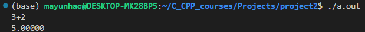<br>

Test case 2: **Little Complex Operation**<br>
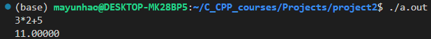<br>Test case 3: **One Bracket Test**<br>
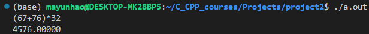<br>

Test case 4: **Multi-brackets Test**<br>
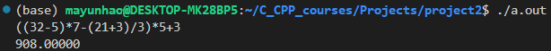<br>
Test case 5: **Integer input overflow and output overflow**<br>

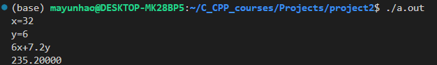<br>

Test case 6: **Cosine Test**<br>

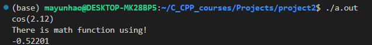 <br>
Test case 7: **Sin Test **<br>
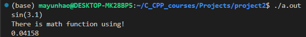<br>
Test case 8: **Sqrt Test**<br>
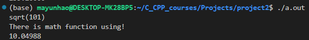<br>

Test case 9: **Very Complex Operation**<br> In this case, many operators together with formulas are used for verifications.
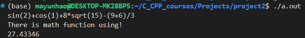

Test case 10: **Big Number Operation**<br>
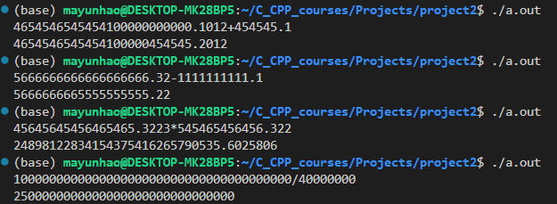<br>

# **Part 4 - Challenges and Solutions**

1. First of all,  considering the basic four type operation is already difficult, because the orders of `+` and `-` are  smaller than `*` and `/`. Firstly, I just take `string` to find every index of operators so that I can get string between two operators. However, the idea can not work correctly because there must be brackets. The priority must follow the principle: `( ) > *, / > +, -`. Thus, after find necessary information from CSDN, I find that the priority choices are often relative to `stack`. Therefore, I highly use stack to make the operation easier, because stack is a last in first off block which matches the custom of reading. One stack is built for numbers and the other one is built for operators. Every time there enters a new char, the system will judge if its property. If numbers are read, initialize a char array to hold numbers and put it into `operate_num` stack, by using `push`. When finishing reading, use `pop ` to clean. Similarly, if operators are read, check the priority of them with the current `operate_sign` stack `top`, and initialize a char array to hold operators and put it into `operate_sign` stack. If `(` is met, conduct the inner operation first until system meets `)`. Corresponding calculation then can be implemented through `switch`.

2. For any condition which is not pure digital inputs, I use `replace` to complete then. For inputs consist of x and y, they are relatively easy to deal with because I just need to replace the original string with calculated values. For math formulas, the challenge is to find the values apart from formulas themselves. Thus, I use `while` to detect if there is special item in the input stream and use both`substr` and `find`to find their indexes. Finally, I use `replace ` to replace the original text with numerical values. By such positioning and replacement, all functions or mathematical formulas are replaced by specific numerical values, so that `stack_for_calculate` can work. Luckily, complexes of root number calculations, sine calculations, and cosine operations that include four operations can get the right results with my method.

3. The big number operation is another challenge. During my coding, I can not combine the stack with big number operation since stack is initialized as `stack<double>` while big numbers should be recognized as `string`. Thus, I reload some methods for input string operations, shown as `myAdd, mySubstract, myMultiply` and `my myDivide`. These methods first determine whether there is a decimal point, call the method normally if there is not, and iterate over the method within the method if there is a decimal point. The specific code is shown below.

   ```cpp
   if (a.find(".")>=0&&a.find(".")<a.size()&&b.find(".")>=0&&b.find(".")<b.size()){
           string a_r = a.substr(a.find(".")+1); string a_l = a.substr(0,a.find("."));
           string b_r = b.substr(b.find(".")+1); string b_l = b.substr(0,b.find("."));
           reverse(a_r.begin(),a_r.end());
           reverse(b_r.begin(),b_r.end());
           string answer_l = myAdd(a_l,b_l);
           string answer_r = myAdd(a_r,b_r);
           reverse(answer_r.begin(),answer_r.end());
           return answer_l+"."+answer_r;
       }
       else if(a.find(".")>=0&&a.find(".")<a.size()){
           string a_r = a.substr(a.find(".")+1); string a_l = a.substr(0,a.find("."));
           string answer_l = myAdd(a_l,b);
           return answer_l+"."+a_r;
       }
       else if(b.find(".")>=0&&b.find(".")<b.size()){
           string b_r = b.substr(b.find(".")+1); string b_l = b.substr(0,b.find("."));
           string answer_l = myAdd(a,b_l);
           return answer_l+"."+b_r;
       }
   ```

   

   The inputs of these methods are strings. For `myAdd` and `mySubstract`, the operation is bit by bit. For `myAdd`, the key idea is shown as the following.

   ```cpp
   while(i>=0&&j>=0){ans[k--]=(a[i--]-'0')+(b[j--]-'0');}
   while(j>=0){ans[k--]=(b[j--]-'0');}
   while(i>=0){ans[k--]=(a[i--]-'0');}
   ```

   If there is any carryout, the following code can detect.

   ```cpp
   string c="";
   for(int i=n-1;i>0;i--)
   	{ 
   		if(ans[i]>=10)
   		{
   			ans[i]-=10;
   			ans[i-1]++;
   		}
   		c.insert(0,1,ans[i]+'0');
   	} 
   ```

    The working principle is similar to `mySubstract`. For `mySubstract`, the key idea is shown as the following.

   ```cpp
   while(i>=0)
   	{
   	    char nowb;
   	    if(j>=0) nowb=b[j];
   	    else nowb='0';
   		ans[k]=a[i]-nowb-t;
   		if(ans[k]<0)
   		{
   			t=1;
   			ans[k]+=10;
   		} 
   		else t=0;
   		k--,i--,j--;
   	}
   ```

   For `myMultiply`, the key idea is shown as the following.

   ```cpp
   for(int i=0;i<n;i++) 
   	{                    
   		for(int j=0;j<m;j++)
   		{
   			ans[i+j+1]+=(a[i]-'0')*(b[j]-'0');
   		}
   	}
   	for(int i=n+m-1;i>0;i--)      
   	{
   		if(ans[i]>=10)            
   		{
   			ans[i-1]+=(ans[i]/10);
   			ans[i]%=10;           
   		}
   	}
   ```

   For `myDivide`, the key idea is shown as the following. Division is more like a bit by bit substraction.

   ```cpp
   for(int i=m2-1;i<m1;i++)     
   		{	
   			if(a1=="0")			    
   				a1=""; 
   			a1.push_back(a[i]);     
   			int e=0;
   			while(myCompare(a1,b)>=0)
   			{
   				e++;
   				a1=mySubtract(a1,b);
   			}
   			if(res.size()||e)        
   				res.push_back(e+'0');
   		}
   		ans[0]=res;  
   		ans[1]=a1;
   ```

   

4. Finally, through this project, I consider that it is essential for us to use `stack` and `vectors` in coding. A stack is a first-in, first-out queue. The stack is a special linear table that restricts the insertion and deletion of elements in a linear table to the same end, allowing the end of the insertion and deletion to become the top of the stack (Top), and the fixed section is called the bottom of the stack. According to this, the first element is placed at the bottom of the stack, and the last element is placed at the top of the stack. The first to be put in is deleted later, and the one that is put in later is deleted first, which is suitable for this task. Besides, vector is dynamic array template class for holding different size of variables. It is so far similar to `array [][]` in Java, and helps me a lot. In the future, I will continue learn the beauty of stack and vectors and apply them into next projects.
